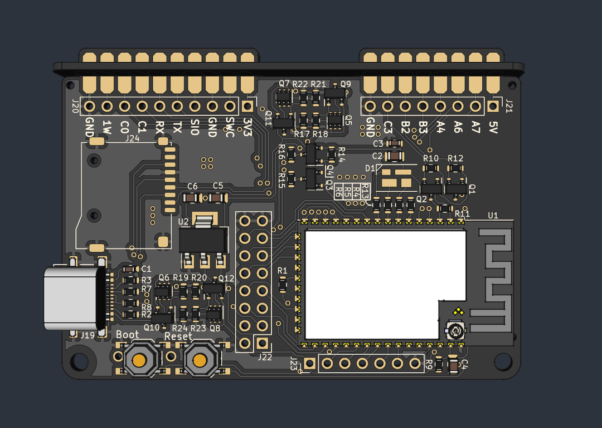

# Flipper Zero Backpacks <!-- omit in toc -->

This is a collection of addon boards for the [Flipper Zero](https://flipperzero.one/) multi-tool in the style of a backpack that clips behind the Flipper!

Right now it features only an ESP32 wifi board, like the official wifi devboard, only formatted as a backpack and with an SD card slot fitted.
As soon as this board is verified (currently in production) protoboards and other addons will be created in the same form factor!

The backpack framework is designed to fit snugly to a Flipper inside its silicone case. Without a silicone sleeve, the board will have 2mm of space around the Flipper, which might be undesireable.

Finished designs will be stocked at Tindie.
The first prototype run will be quite limited but if there is interest in more, a bigger batch will be produced.

**If you like my work please consider [supporting my caffeine addiction](https://github.com/Chrismettal#donations)!**

## Table of contents <!-- omit in toc -->

- [Boards](#boards)
  - [Connecting piece](#connecting-piece)
  - [ESP32 Wifi Dev board](#esp32-wifi-dev-board)
    - [Internal / External Antenna](#internal--external-antenna)
  - [Protoboard](#protoboard)
- [Sources](#sources)
- [Donations](#donations)
- [License](#license)

## Boards

All boards use `1mm board thickness` unless otherwise specified.

### Connecting piece

Every board uses the same connector up top. This is what plugs into the Flipper and makes the board an actual backpack.
The addon board and the connecting piece slide into each other and get soldered at the intersection to form a solid, right angle connection.

### ESP32 Wifi Dev board

Very similar to the official Wifi dev board. Additionally includes a micro SD card slot so you don't have to mod the official board yourself. Currently in production, to be stocked at [Tindie](https://www.tindie.com/stores/binary-6/) soon after production finished.

#### Internal / External Antenna

The ESP32-S2 part number referenced in the BOM ([C701334](https://www.lcsc.com/product-detail/WiFi-Modules_Espressif-Systems-ESP32-S2-WROVER-I-N4R2_C701334.html)) leads to an `-I` version of the ESP32-S2, which has the antenna plug mounted on the ESP. Versions without the `-I` in the product name do not have the antenna plug mounted. Next to the antenna plug is a small jumper that is set accordingly, to use either the internal PCB antenna, or the external plug antenna.

By default, `-I` ESPs have the jumper set to use an external antenna via the plug. 

**If you intend to use the internal PCB antenna you will need to move the jumper over, if you use an `-I` ESP32-S2!**

**If you use a non `-I` variant of the ESP32-S2, like the boards found in the shop, you would have to mount an antenna plug before being able to use the external antenna**

### Protoboard

A simple `2.54mm` pitch protoboard backpack, fitting the same case as the ESP32 board. While it is through hole, beware that there isn't much space between the Flippers silicone case and the board, so make sure to only put taller components on the side facing away from the flipper, and stay pretty flat when wiring on the bottom side. Also remember that the bottom side will be somewhat exposed, so you should consider placing and wiring mostly on the encased side.

## Sources

- [ESP32-S2-WROVER step file](https://grabcad.com/library/esp32-s2-wrover-1)

## Donations

**If you like my work please consider [supporting my caffeine addiction](https://github.com/Chrismettal#donations)!**

## License

  This work is licensed under a <a rel="license" href="http://creativecommons.org/licenses/by-sa/4.0/">Creative Commons Attribution-ShareAlike 4.0 International License</a>.
