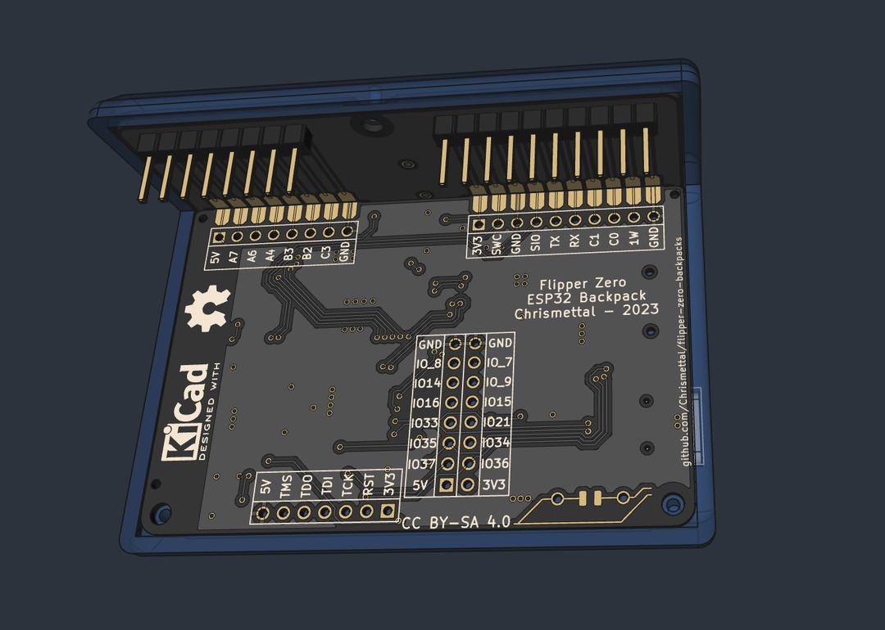
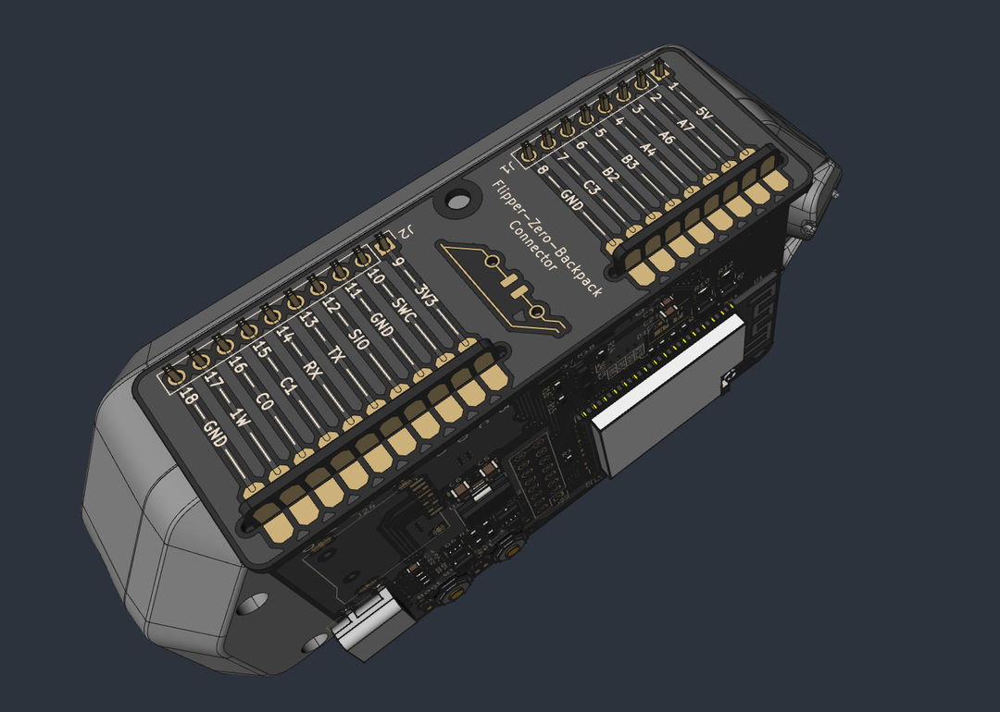
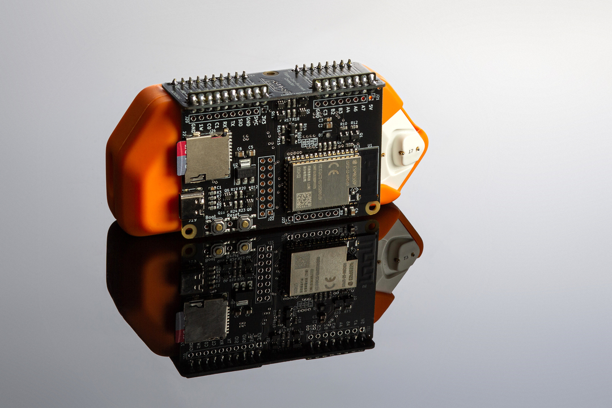

# Flipper Zero Backpacks <!-- omit in toc -->

This is a collection of addon boards for the [Flipper Zero](https://flipperzero.one/) multi-tool in the style of a backpack that clips behind the Flipper!

Right now it features only an ESP32 wifi board, like the official wifi devboard, only formatted as a backpack and with an SD card slot fitted. There is also a protoboard to create your own designs in the same formfactor.

The backpack framework is designed to fit snugly to a Flipper inside its silicone case. Without a silicone sleeve, the board will have 2mm of space around the Flipper, which might be undesireable.

Finished designs are currently stocked at [Tindie](https://www.tindie.com/stores/binary-6/).

**If you like my work please consider [supporting my caffeine addiction](https://github.com/Chrismettal#donations)!**

## Table of contents <!-- omit in toc -->

- [Boards](#boards)
  - [Connecting piece](#connecting-piece)
  - [ESP32 Wifi Dev board](#esp32-wifi-dev-board)
    - [Firmware](#firmware)
    - [Internal / External Antenna](#internal--external-antenna)
    - [SD Card](#sd-card)
  - [Protoboard](#protoboard)
  - [Raspberry Pi Zero W](#raspberry-pi-zero-w)
    - [Building](#building)
    - [PCF8523](#pcf8523)
- [Making your own](#making-your-own)
- [3D Printing](#3d-printing)
- [Building guide](#building-guide)
- [Sources](#sources)
- [Donations](#donations)
- [License](#license)

## Boards

All boards use `1mm board thickness` unless otherwise specified.

### Connecting piece

Every board uses the same connector up top. This is what plugs into the Flipper and makes the board an actual backpack.
The addon board and the connecting piece slide into each other and get soldered at the intersection to form a solid, right angle connection.

### ESP32 Wifi Dev board

Very similar to the [official Wifi dev board](https://shop.flipperzero.one/collections/flipper-zero-accessories/products/wifi-devboard). Additionally includes a micro SD card slot so you don't have to mod the official board yourself. 

Other than that all guides applicable to the official Wifi dev board are also applicable here.

In this repo, there are 3D files for boards with the internal, as well as the external antenna available. The board is the same between the two, only the part number of the ESP changes.

#### Firmware

The board ships with the [Black Magic debugger firmware](https://black-magic.org/), just like the official board. Alternatively you can use an alternate firmware like the [ESP32 Marauder](https://github.com/justcallmekoko/ESP32Marauder/wiki/flipper-zero) by [JustCallMeKoko](https://github.com/justcallmekoko) if you want to get spicy.

**Every firmware that works on the [official dev board](https://shop.flipperzero.one/collections/flipper-zero-accessories/products/wifi-devboard) should also work on this backpack**

#### Internal / External Antenna

The ESP32-S2 part number referenced in the BOM ([C701334](https://www.lcsc.com/product-detail/WiFi-Modules_Espressif-Systems-ESP32-S2-WROVER-I-N4R2_C701334.html)) leads to an `-I` version of the ESP32-S2, which has the antenna plug mounted on the ESP. Versions without the `-I` in the product name do not have the antenna plug mounted. Next to the antenna plug is a small jumper that is set accordingly, to use either the internal PCB antenna, or the external plug antenna.

By default, `-I` ESPs have the jumper set to use an external antenna via the plug. 

**If you use a non `-I` variant of the ESP32-S2, like the boards found in the shop, you would have to mount an antenna plug before being able to use the external antenna**

**if you use an `-I` ESP32-S2 you would need to move the jumper over to use the internal antenna!**

#### SD Card

kThe ESP seems to be pretty restrictive in SD Card compatibility especially when running Marauder. This is not a limitation of this specific design but inherent to the ESP32. I've had luck with older and smaller SD cards sub 16 GB and Class 10 at max. OLDER `Sandisk Ultra Micro SDHC I` seem to work pretty well when formatted to `FAT32`.

### Protoboard

A simple `2.54mm` pitch protoboard backpack, fitting the same case as the ESP32 board. While it is through hole, beware that there isn't much space between the Flippers silicone case and the board, so make sure to only put taller components on the side facing away from the flipper, and stay pretty flat when wiring on the bottom side. Also remember that the bottom side will be somewhat exposed, so you should consider placing and wiring mostly on the encased side.

### Raspberry Pi Zero W

(Better image to follow once boards arrive)

This is an adapter to supply and connect a Raspberry Pi Zero W to the Flipper via UART.

The board was mainly created for the [Flippagotchi](https://github.com/Matt-London/pwnagotchi-flipper) app, which renders a [Pwnagotchi](https://pwnagotchi.ai/)`s screen onto the flipper.

Additionally, the board includes a `PCF8523` realtime clock so your Pwnagotchi actually knows what time it is. The battery used for the RTC is a `CR927`.

TODO https://pwnagotchi.ai/configuration/#connecting-to-pi0w-with-microusb-cable-on-linux-host
TODO https://learn.adafruit.com/adding-a-real-time-clock-to-raspberry-pi/set-rtc-time 
TODO 'sudo date -s 'YYYY-MM-DD HH:MM:SS' if there is no internet

#### Building

The soldering guide can be found on the PCB itself. You will need a Raspberry Pi Zero W WITHOUT ANY PIN HEADERS MOUNTED, which will be layed flat onto the adapter PCB before being screwed down. The required pin headers will then just be filled with solder.

#### PCF8523

TODO: Doc on how to set time follows when the boards arrive

## Making your own

All files to order your own boards from existing designs can be found under `/pcb/<BoardName>/FabricationFiles`. This includes Gerbers as well as BOMs for PCBA so the boards arrive fully built. All files were exported to be ordered at JLCPCB and use LCSC part numbers.

**All boards need to be ordered as 1mm thickness so they fit together well!**

There is also a clean KiCad project under `/pcb/Clean/` to create original designs. If you end up creating your own design I would love to merge your fork into this repo!

## 3D Printing

A 3D printable case project is included in `/3d_printing/flipper-zero-backpacks.FCStd`.

You can use [FreeCAD](https://www.freecad.org/) to open and modify it. 

A `bare` version, as well as one fitting the `ESP32` board have been exported as `.step` and `.3mf` files into `/3d_printing/`.

The cases can be printed without any supports and are best printed in PETG, but there is no reason why PLA wouldn't be sufficient.

## Building guide

  
General build guide - click to expand

  **Step 1 - Clamp the back board vertically**

  

  **Step 2 - Slide on the connecting piece**

  

  **Step 3 - Solder down one of the connectors**

  You don't have to care about the angle of the boards for now.

  

  **Step 4 - Reflow the connection, aligning the boards at 90 degrees**

  

  **Step 5 - Make sure the boards are also aligned when viewed from the front**

  

  **Step 6 - Solder the remaining connections on the top**

  

  **Step 7 - Make sure that none of the connections are bridged between the pads horizontally**

  

  **Step 8 - Flip the board around so you can see the bottom connections**

  

  **Step 9 - Solder the bottom connections**

  

  **Step 10 - Flip the board around again and solder the pin headers**

  Make sure to get them at a right angle to the board as well. Otherwise you will put stress on the board when inserting into the Flipper.

  

  **Step 11 - Optional - Find the 3D printed case and screws**

  

  

    
Excursion: Installing the antenna jack for external antenna boards

  **Step 11.1 - Insert the antenna jack into the slot and fix nut from the outside**

  
  
  

  **Step 11.2 - Plug antenna extension into the board**
  
  

  **Step 11.3 - Carefully route the extension while inserting the board**
  
  

  **Step 11.4 - Make sure the board is seated without pinching the wire**
  
  

  

  **Step 12 - Slide the board into the case and screw down the 3 mounting points**

  

  
Raspberry Pi specific assembly - click to expand

  **Step 0 - Find the Wifi board and read the instructions as printed on the board**

  

  **Step 1 - Place the Raspberry on top of the board**

  Note the lack of pin headers. The board won't fit with headers installed!

  

  **Step 2 - Screw down the raspberry using M2.5 screws and nuts from behind**

  The screws are countersunk into the PCB so they will be flat from the outside

  

  **Step 3 - Solder the 7 connections through both boards**

  With the Raspberry face down, heat the pads from the backpack board and apply solder into the hole. You will see the solder "bubble down" through both holes forming a connection between the boards.

  Flipping the board to the front you should see solder ran all the way through both boards. This picture shows 50% of the solder process done, having soldered only from the back:

  

  When it looks like this, apply some solder from the top as well to make the connections look nice from both sides.

  **Step 4 - The finished board should look like this**

  You should now see clean connections between both sides of the board. You can now insert the CR927 battery for the RTC if desired, and continue with the rest of the general build guide, to assemble your backpack.

  

## Sources

- [ESP32-S2-WROVER step file](https://grabcad.com/library/esp32-s2-wrover-1)

## Donations

**If you like my work please consider [supporting my caffeine addiction](https://github.com/Chrismettal#donations)!**

## License

  This work is licensed under a <a rel="license" href="http://creativecommons.org/licenses/by-sa/4.0/">Creative Commons Attribution-ShareAlike 4.0 International License</a>.
